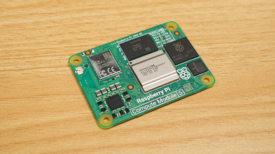

# Homelab

GitOps-managed Kubernetes homelab using Flux CD.

[](https://fluxcd.io/)
[](https://k3s.io/)
[](https://kubernetes.io/)
[](https://longhorn.io/)
[](https://docs.renovatebot.com/)
[](https://grafana.com/)
[](https://www.raspberrypi.com/)

## Overview

This repository contains the complete infrastructure and application configuration for a Kubernetes homelab environment. Everything is managed declaratively through Git, with Flux CD automatically reconciling the cluster state.

## Quick Start

| Environment | Nodes | Storage | Load Balancing | Version |
|------------|-------|---------|----------------|---------|
| **Staging** | 1 server + 3 agents (k3d) | local-path | k3d built-in | K3s v1.31.5 |
| **Production** | 3 control planes (HA) | Longhorn (3-replica) | K3s ServiceLB | K3s v1.33.6 |

### Services

| Service | Staging | Production |
|---------|---------|------------|
| **Linkding** | [linkding-staging.ronaldlokers.nl](https://linkding-staging.ronaldlokers.nl) | [linkding.ronaldlokers.nl](https://linkding.ronaldlokers.nl) |
| **Grafana** | [grafana-staging.ronaldlokers.nl](https://grafana-staging.ronaldlokers.nl) | [grafana.ronaldlokers.nl](https://grafana.ronaldlokers.nl) |
| **Longhorn** | N/A | [longhorn.ronaldlokers.nl](https://longhorn.ronaldlokers.nl) |

## Hardware

### Staging

Runs in Proxmox VM on MS-01 mini PC:
- **Platform**: k3d (K3s in Docker)
- **Host**: Ubuntu Server VM with Docker
- **IP**: 10.0.40.52

### Production

Runs in a Sipeed NanoCluster with Raspberry Pi CM5 modules:
- **3 nodes**: kube-srv-1, kube-srv-2, kube-srv-3
- **Compute Module**: Raspberry Pi CM5
- **RAM**: 16GB per node
- **Storage**: 64GB eMMC per node
- **IPs**: 10.0.40.101, 10.0.40.102, 10.0.40.103

<div align="center">
  
  <p><em>Sipeed NanoCluster</em></p>
</div>

<div align="center">
  
  <p><em>Raspberry Pi Compute Module 5</em></p>
</div>

## Stack

- **GitOps**: [Flux CD](https://fluxcd.io/) - Continuous delivery from Git
- **Automation**: [Renovate](https://docs.renovatebot.com/) - Automated dependency updates
- **Certificates**: [cert-manager](https://cert-manager.io/) - Automatic TLS with Let's Encrypt
- **Ingress**: [Traefik](https://traefik.io/) - Ingress controller
- **Storage**: [Longhorn](https://longhorn.io/) - Distributed block storage (production only)
- **Monitoring**: [kube-prometheus-stack](https://github.com/prometheus-operator/kube-prometheus) - Prometheus & Grafana
- **Applications**: [Linkding](https://github.com/sissbruecker/linkding) - Bookmark manager

## Documentation

- **[Setup Guide](docs/setup.md)** - How to set up staging and production clusters
- **[Architecture](docs/architecture.md)** - Repository structure, deployment flow, and networking
- **[Security](docs/security.md)** - SOPS encryption and secrets management
- **[Stack Details](docs/stack.md)** - Detailed component information

## Key Features

### High Availability (Production)

- **Control Plane**: 3-node HA with embedded etcd (survives 1-node failure)
- **Storage**: Longhorn with 3-replica redundancy (survives 2-node failure)
- **Load Balancing**: K3s ServiceLB distributes traffic across all nodes
- **Certificates**: Automatic TLS with Let's Encrypt DNS-01 challenges

### GitOps Workflow

1. Push changes to Git repository
2. Flux detects changes within 10 minutes (or instant with manual reconciliation)
3. Flux applies changes to the cluster
4. Health checks ensure successful deployment

### Automated Updates

- Renovate scans for dependency updates hourly
- Creates pull requests with changelogs
- Review and merge to automatically deploy updates

### Security

- Secrets encrypted with [SOPS](https://github.com/getsops/sops) using [age](https://github.com/FiloSottile/age)
- Separate encryption keys for staging and production
- TLS certificates for all services
- Private keys stored in Proton Pass (not in Git)

## Repository Structure

```
.
├── clusters/              # Flux entry points for each environment
├── infrastructure/
│   ├── controllers/       # Core services (cert-manager, longhorn, renovate)
│   └── configs/          # Infrastructure configuration (issuers, middlewares)
├── apps/                 # Applications (linkding)
├── monitoring/           # Observability (kube-prometheus-stack, dashboards)
└── docs/                 # Documentation
```

See [Architecture](docs/architecture.md) for detailed structure information.

## Contributing

This is a personal homelab repository, but feel free to use it as inspiration for your own setup!

## License

This repository is provided as-is for educational purposes.
